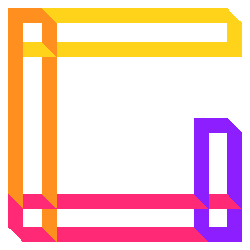
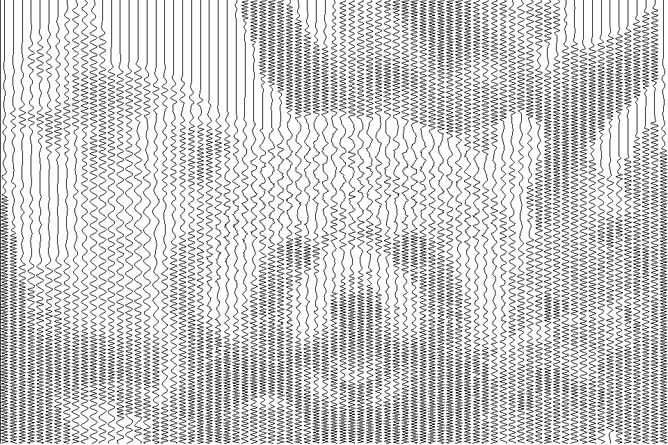

<h1 align="center">Generative</h1>

  
  
  
  
  
  

---

**Generative** (__WIP__) is 2D generational arts creation library written in Rust.
Currently it is in nascent stage and is somewhat unstable.

## Example Outputs

Outputs

#### Perlin Loop

#### Watercolored Cirles

#### Mandelbrot

#### Generating sinusoidal wave image
|Original|Wave Image|
|:------:|:--------:|
|||

## Current features:
- [ ] 2D Shape + Transformations (Translation, Rotation, Shearing in X and Y) + Anti-Aliasing
  - [x] Lines
  - [x] Line from multiple points
  - [x] Squares
  - [x] Rectangles
  - [x] Polygons
  - [x] Circles
  - [ ] Ellipse
- [x] Curves + Transformations (Translation, Rotation, Shearing in X and Y) + Anti-Aliasing
  - [x] Catmull-Rom Spline (Uniform + Centripetal + Chordal)
  - [x] n-degree Bezier curve
## TODO:
- A lot of things
